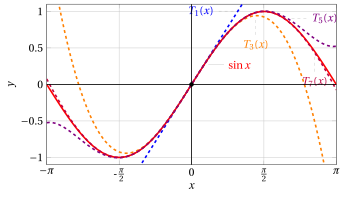

# Series of functions

**Part 5 · Series · Chapter 4** · lecture notes by Fabio Furini · [:material-file-pdf-box: Chapter PDF](../pdf/series-04-series-of-functions.pdf)

## 1. Series of functions

- <strong>Series of functions</strong> are numerical series depending on a parameter $x$: when these series converge for every value $x$ belonging to a certain interval, they represent <strong>functions of a new kind</strong>

- There are two important classes of series of functions, namely trigonometric series and power series. We will only deal with <strong>power series</strong>, also called <strong>Taylor series</strong>, which can be seen as a natural extension of Taylor expansions.

### 1.1 Taylor series of the elementary transcendental functions

- Taylor's expansion/formula with Lagrange remainder can be rewritten in the form:

    \begin{equation}
    f(x) = \sum_{k=0}^n  \frac{f^{(k)}(x_0)}{k!} \; (x-x_0)^k + E_n(x)
    \end{equation}

    where the Lagrange approximation error is

    \begin{equation}
    E_n(x) = \frac{f^{(n+1)}(c)}{(n+1)!} \;(x-x_0)^{n+1}
    \end{equation}

    and $c$ is a suitable point between $x_0$ and $x$.

!!! definizione "Definition 1: Taylor series"

    If a function $f$ has derivatives of every order, the series

    $$
    \sum_{k=0}^{\infty} \frac{f^{(k)}(x_0)}{k!} \; (x-x_0)^k
    $$

    is called the <strong>Taylor series</strong> of the function $f$ centered at $x_0$.

!!! chiave ""

    At a given point $x \in  (a, b)$, if the error

    $$
    E_n(x) \rr 0 {\rm ~~~as~~~} n \rr \ip
    $$

    then the Taylor series is convergent and its sum equals $f(x)$. This is equivalent to saying that the $n$-th partial sum of the series has a finite limit and this limit is precisely $f(x)$. In formulas:

    $$
    \underbrace{T_{n,x_0} (x)}_{{\rm Taylor~polynomial}} =  \sum_{k=0}^n \frac{f^{(k)}(x_0)}{k!} \; (x-x_0)^k \rr f(x) {\rm ~~~as~~~} n \rr \ip
    $$

!!! definizione "Definition 2: function expandable in Taylor series on an interval"

    Given a function $f:D \rr \R$ with derivatives of every order, if

    $$
    E_n(x) \rr 0  {\rm ~~as~~} n\rr \ip, ~~~\forall x \in I \subseteq D
    $$

    we say that $f(x)$ is <strong>expandable in Taylor series</strong> on the interval $I$.

- There are (infinitely differentiable) functions that are expandable in Taylor series on the whole real line, others that are expandable only on a bounded interval, and others for which the interval reduces to a single point (the point $x_0$).

- We now deal with the three elementary transcendental functions:

    $$
    f(x)=e^x,~~~f(x)=\sin x {\rm ~~~and~~~}f(x)=\cos x
    $$

    which we will show to be expandable in Taylor series on the whole of $\R$. They are three transcendental (not algebraic) functions.

- Real functions of a real variable are classified into <strong>algebraic functions and transcendental functions</strong>. Algebraic functions are built through a finite number of applications of the four arithmetic operations, of raising to a power and of extracting the $n$-th root.  Transcendental functions are all the functions that are not algebraic.

#### The Taylor series of the exponential function

!!! esempio "Example 1: Maclaurin formula/expansion of the exponential"

    Maclaurin formula/expansion of order $n$ of the exponential with Lagrange remainder:

    $$
    e^x = T_{n}(x) + \frac{e^c}{(n+1)!} \;x^{n+1} = 1 + x + \frac{x^2}{2} + \frac{x^3}{3!} + {\rm \dots} + \frac{x^n}{n!} + \frac{e^c}{(n+1)!} \;x^{n+1}  {\rm ~~with~~} c \in [0,x]
    $$

    { .fig .ovale loading=lazy style="width:64%" }

!!! osservazione "Remark 1: Taylor series of the exponential function"

    $$
    \forall x \in \R,~~~~ e^x =\sum_{k=0}^{\infty} \frac{x^k}{k!}
    $$

??? dimostrazione "Proof"

    From the Maclaurin expansion of order $n$ of $e^x$ with Lagrange remainder,  we have that for every integer $n$ and $x \in \R$ there exists a point $c$, lying between $0$ and $x$, such that:

    $$
    e^x =\sum_{k=0}^{n} \frac{x^k}{k!} + \frac{e^c}{(n+1)!} \;x^{n+1}
    $$

    We fix $x$ and let $n$ tend to $\ip$. The point $c$ may vary with $n$ but, since it always lies between $0$ and $x$, we have:

    $$
    e^c \le
    \begin{cases}
    e^x &{\rm if~~} x >0\\
    1 & {\rm if~~} x <0
    \end{cases}
    $$

    and $e^0=1$, hence $e^c$ stays bounded. From the hierarchy of infinities theorem we have:

    $$
    \frac{x^{n+1}}{(n+1)!} \rr 0 {\rm ~~as~~} n \rr \ip
    $$

    hence the error tends to zero, that is:

    $$
    \frac{x^{n+1} }{(n+1)!} \; e^c\rr 0 {\rm ~~as~~} n \rr \ip
    $$

    since it is the product of an infinitesimal sequence and a bounded one. We have therefore proved that the function $e^x$ can be written as the sum of a power series, its Taylor series, convergent for every $x \in \R$. □

!!! osservazione "Remark 2"

    \begin{equation}
    \label{second}
     e = \sum_{k=0}^{\infty} \frac{1}{k!}
    \end{equation}

??? dimostrazione "Proof"

    It suffices to set $x$ equal to 1 in the Taylor series of the exponential function. □

- We have derived a second definition of Euler's number $e$ (Napier's constant); the first one was:

    \begin{equation}
    \label{first}
     e = \lim_{k \rr \ip} \left(1 + \frac{1}{k} \right)^k
    \end{equation}

- Consequently, we have two methods for computing an approximation of the value of $e$:

    1. The first method is based on formula \(\eqref{first}\), and by fixing $k=n$ we obtain the approximation:

        $$
        e \approx \left(1 + \frac{1}{n} \right)^n
        $$

    2. The second method is based on formula \(\eqref{second}\), and by computing the $n$-th partial sum we obtain the approximation:

        $$
        e \approx  \sum_{k=0}^{n} \frac{1}{k!}
        $$

    
<table>
    <tr>
    <td></td>
    <td>\(\left(1 + \frac{1}{n} \right)^n\)</td>
    <td>\(\sum_{k=0}^{n} \frac{1}{k!}\)</td>
    <td>\(e\)</td>
    </tr>
    <tr>
    <td>\(n=1\)</td>
    <td>\(2.0000000000\dots\)</td>
    <td>\(2.0000000000\dots\)</td>
    <td>\(2,7182818284\dots\)</td>
    </tr>
    <tr>
    <td>\(n=2\)</td>
    <td>\(2.2500000000\dots\)</td>
    <td>\(2.5000000000\dots\)</td>
    <td>\(2,7182818284\dots\)</td>
    </tr>
    <tr>
    <td>\(n=3\)</td>
    <td>\(2.3703703704\dots\)</td>
    <td>\(2.6666666666\dots\)</td>
    <td>\(2,7182818284\dots\)</td>
    </tr>
    <tr>
    <td>\(n=4\)</td>
    <td>\(2.4414062500\dots\)</td>
    <td>\(2.7083333333\dots\)</td>
    <td>\(2,7182818284\dots\)</td>
    </tr>
    <tr>
    <td>\(n=5\)</td>
    <td>\(2.4883200000\dots\)</td>
    <td>\(2.7166666666\dots\)</td>
    <td>\(2,7182818284\dots\)</td>
    </tr>
    </table>

    { .fig .ovale loading=lazy style="width:80%" }

- The second method is therefore much more efficient at approximating the value of $e$

#### The Taylor series of the elementary trigonometric functions

!!! esempio "Example 2: Maclaurin formula/expansion of sine and cosine"

    Maclaurin formula/expansion of odd order of the sine with Lagrange remainder:

    \begin{align*}
    \sin x & = T_{2\;k+1}(x) + \frac{\sin^{(2\;k+2)}(c)}{(2\;k+2)!} \;x^{2\;k+2}\\ 
    &=  x - \frac{x^3}{3!} + \frac{x^5}{5!} + {\rm \dots} + (-1)^k\;\frac{x^{2\:k+1}}{(2\:k+1)!}  + \frac{\sin^{(2\;k+2)}(c)}{(2\;k+2)!} \;x^{2\;k+2}  {\rm ~~with~~} c \in [0,x]
    \end{align*}

    { .fig .ovale loading=lazy style="width:80%" }

    Maclaurin formula/expansion of even order of the cosine with Lagrange remainder:

    \begin{align*}
    \cos x & = T_{2\;k}(x) + \frac{\cos^{(2\;k+1)}(c)}{(2\;k+1)!} \;x^{2\;k+1}\\ 
    &=  1 - \frac{x^2}{2!} + \frac{x^4}{4!} + \dots + (-1)^k\;\frac{x^{2\:k}}{(2\:k)!}  + \frac{\cos^{(2\;k+1)}(c)}{(2\;k+1)!} \;x^{2\;k+1}  {\rm ~~with~~} c \in [0,x]
    \end{align*}

    { .fig .ovale loading=lazy style="width:80%" }

!!! osservazione "Remark 3: Taylor series of the elementary trigonometric functions"

    $$
    \forall x \in \R,~~~~ \sin x = \sum_{k=0}^{\infty} (-1)^k\;\frac{x^{2\:k+1}}{(2\:k+1)!},~~~\cos x = \sum_{k=0}^{\infty} (-1)^k\;\frac{x^{2\:k}}{(2\:k)!}
    $$

??? dimostrazione "Proof"

    □

## 2. Series in the complex field
